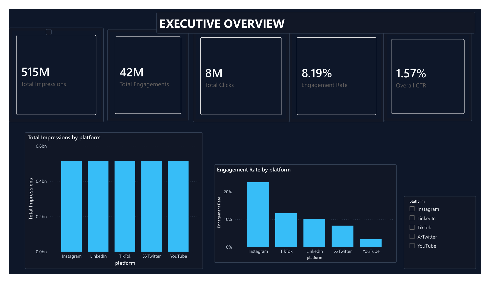
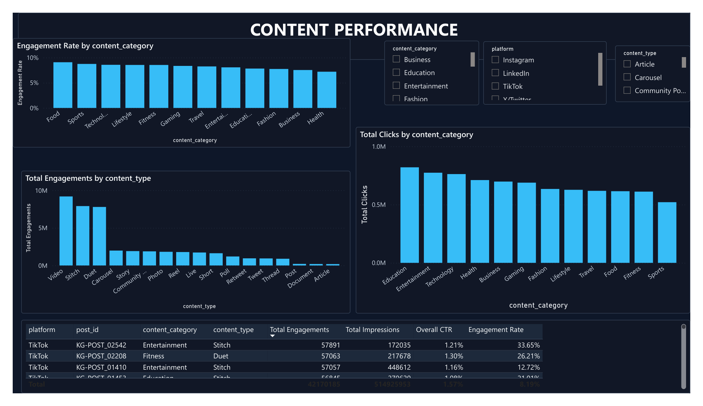
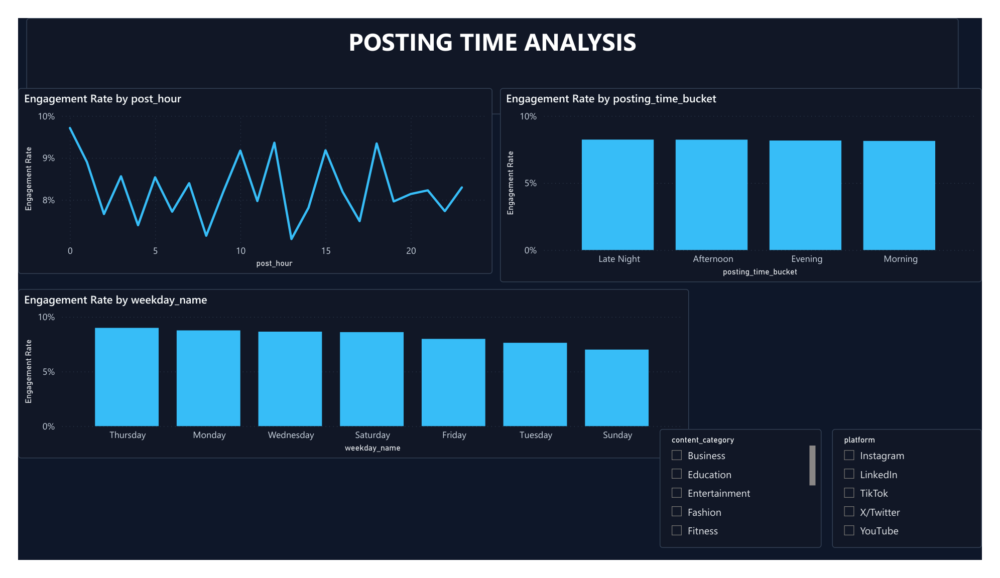
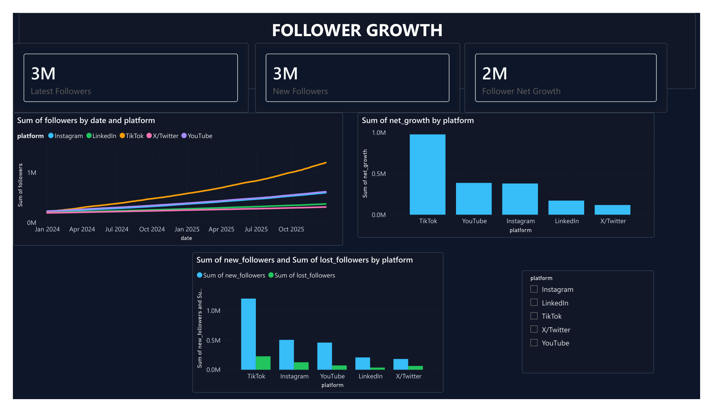
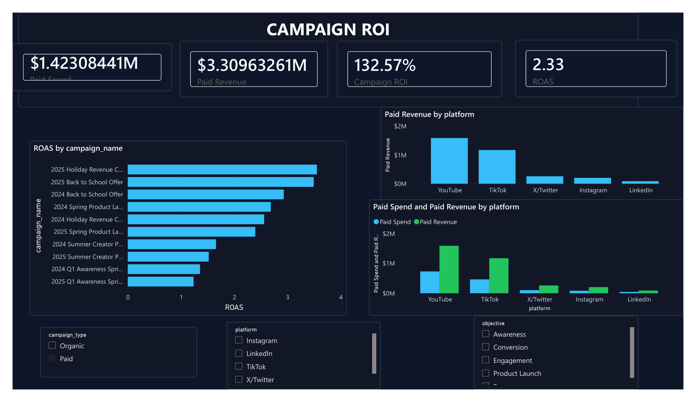
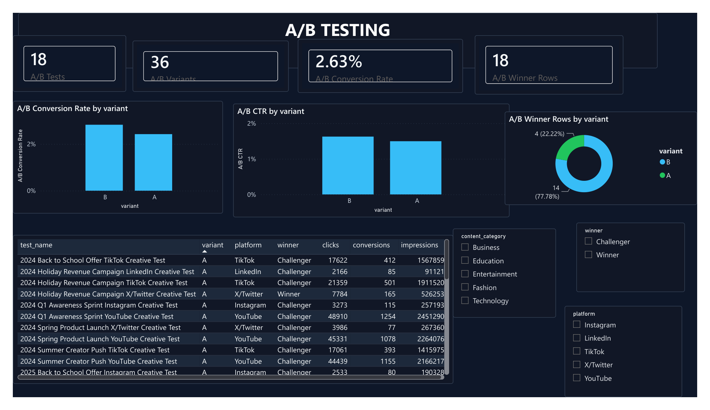

# Social Media Content Performance Analytics

Power BI analytics project for evaluating social media content performance, posting-time effectiveness, follower growth, campaign ROI, and A/B test outcomes across major platforms.

## Project Overview

The project analyzes multi-platform social media performance using a Kaggle-backed dataset enriched with campaign and business metrics for dashboard analysis.

Key questions answered:

- Which platforms and content categories drive the strongest engagement?
- What posting days and hours perform best?
- How are followers growing by platform?
- Which campaigns deliver the highest ROI and ROAS?
- Which A/B test variants perform best?

## Tools Used

- Python for data preparation, validation, and optional SQLite loading
- Kaggle public dataset through `kagglehub`
- SQL through local SQLite tables and analysis views
- Power BI Desktop for dashboarding
- CSV files as the default reporting data layer

## Data Source

Primary dataset:

- [Social Media Engagement Dataset](https://www.kaggle.com/datasets/aviral342/social-media-engagement-dataset)

The dataset provides post-level fields such as timestamp, platform, content type, category, likes, comments, shares, views, saves, follower count, posting hour, sentiment, influencer tier, media flag, and verified status.

The preparation script filters the data to:

- Instagram
- YouTube
- TikTok
- LinkedIn
- X/Twitter

Additional dashboard fields are modeled for analysis completeness, including reach, clicks, campaign assignment, spend, revenue, ROI, ROAS, daily follower movement, and A/B test outcomes.

## Dashboard Pages

The Power BI dashboard is designed around six report pages:

- Executive Overview
- Content Performance
- Posting Time Analysis
- Follower Growth
- Campaign ROI
- A/B Testing

Power BI build assets are in `powerbi/`:

- `README.md`: import, model, and hosting instructions
- `measures.dax`: dashboard measures
- `dashboard_pages.md`: visual-by-visual page blueprint
- `power_query_template.pq`: optional Power Query typing templates
- `social_media_theme.json`: report theme

## Key Metrics

- Impressions and reach
- Likes, comments, shares, saves, and total engagements
- Engagement rate and click-through rate
- Follower growth and churn
- Campaign spend, revenue, ROI, and ROAS
- Conversion rate and cost per conversion
- A/B test winner and variant lift

## Repository Structure

```text
.
|-- data/
|   |-- processed/
|   |   |-- ab_tests.csv
|   |   |-- campaigns.csv
|   |   |-- date_table.csv
|   |   |-- followers_daily.csv
|   |   |-- platforms.csv
|   |   |-- posts.csv
|   |   |-- source_manifest.csv
|-- powerbi/
|   |-- README.md
|   |-- dashboard_pages.md
|   |-- measures.dax
|   |-- power_query_template.pq
|   |-- social_media_content_performance_dashboard.pbix
|   |-- social_media_dark_theme.json
|   |-- social_media_theme.json
|-- screenshots/
|   |-- 01_executive_overview.png
|   |-- 02_content_performance.png
|   |-- 03_posting_time_analysis.png
|   |-- 04_follower_growth.png
|   |-- 05_campaign_roi.png
|   |-- 06_ab_testing.png
|-- scripts/
|   |-- build_sqlite_db.py
|   |-- prepare_kaggle_social_media_data.py
|   |-- validate_data.py
|-- sql/
|   |-- schema_and_views.sql
|-- requirements.txt
|-- README.md
```

## Reproduce the Dataset

```bash
python -m pip install -r requirements.txt
python scripts/prepare_kaggle_social_media_data.py
python scripts/validate_data.py
```

## Build the Optional SQLite Database

The Power BI dashboard should use the CSV files for the simplest setup. The SQLite database is included so the project also demonstrates SQL analysis.

```bash
python scripts/build_sqlite_db.py
```

This creates `data/social_media_analytics.sqlite` with the base tables and these SQL views:

- `v_post_performance`
- `v_posting_time_performance`
- `v_campaign_roi`
- `v_follower_growth_monthly`
- `v_ab_test_results`

## Dashboard Preview

### Executive Overview



### Content Performance



### Posting Time Analysis



### Follower Growth



### Campaign ROI



### A/B Testing



## Validation

The validation script checks:

- Expected CSV files are present
- Required columns exist
- IDs are unique where required
- No blank platform, category, or date fields
- Engagement rate, CTR, ROI, ROAS, and conversion rate calculations are valid
- Each A/B test has exactly one winner

Current processed dataset:

- `posts.csv`: 4,016 rows
- `campaigns.csv`: 55 rows
- `followers_daily.csv`: 3,655 rows
- `ab_tests.csv`: 36 rows
- `date_table.csv`: 731 rows
- `platforms.csv`: 5 rows

Profiled dashboard totals:

- Date range: 2024-01-01 to 2025-12-31
- Total impressions: 514,925,953
- Total reach: 385,622,153
- Total engagements: 42,170,185
- Total clicks: 8,083,542
- Overall engagement rate: 8.19%
- Overall CTR: 1.57%
- Paid ROAS: 2.33

## Power BI Hosting Note

Build locally with free Power BI Desktop. For no-cost submission, the safest options are a `.pbix` file, PDF export, screenshots, or a short screen recording. Public `Publish to web` can work for portfolio sharing only if the data is safe to expose publicly and the Power BI tenant allows it. Private sharing generally requires Power BI Pro/PPU or eligible Premium/Fabric capacity.
